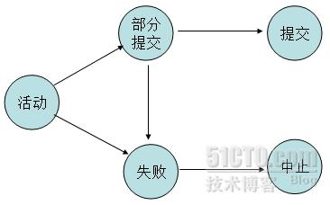

> 参考 http://tech.meituan.com/innodb-lock.html

## 1.事务
事务是访问并可能更新数据库中各种数据项的一个程序执行单元，是一组原子性的SQL语句。

### 1.1.事务的特性
acid

- automicity:原子性，事务中包含的操作，要么都完成，要么都不执行，不可分割
- consisitency:一致性,事务必须是使数据库从一个一致性状态变成另一个一致性状态。
- isolation:隔离性，一个事务的执行不能被其他事务干扰，既一个事务内部的操作及使用的数据对并发的其他事务是隔离的，并发执行的各个事务之间不能互相干扰
- durability:持久性，指一个事务一旦提交，它对数据库中数据的改变就应该是永久性的。接下来的其他操作或故障不应该对其有任何影响

### 1.2.事务的状态
活动 部分提交 失败 中止 提交



### 1.3.InnoDB加锁机制

> 数据库为了维护acid，尤其是一致性和隔离性，一般使用加锁这种方式。同时数据库又是个高并发的应用，如果加锁过度，会极大降低并发处理能力。

#### 1.3.1 一次封锁或两段锁

因为有大量的并发访问，为了预防死锁，一般应用中推荐使用一次封锁法，就是在方法的开始阶段，已经预先知道会用到哪些数据，然后全部锁住，在方法运行之后，再全部解锁。这种方式可以有效的避免循环死锁，但在数据库中却不适用，因为在事务开始阶段，数据库并不知道会用到哪些数据。数据库遵循的是两段锁协议，将事务分成两个阶段，加锁阶段和解锁阶段。

* 加锁阶段：在该阶段可以进行加锁操作。在对任何数据进行读操作之前要申请并获得S锁（共享锁，其他事务可以继续使用共享锁，但不能加排他锁），在进行写操作之前要申请并获得X锁（排它锁，其它事务部能再获得任何锁）。加锁不成功，则事务进入等待状态，直到加锁成功才继续执行。
* 解锁阶段：当事务释放了一个封锁以后，事务进入解锁阶段，在该阶段只能进行解锁操作不能再进行加锁操作

这种方式虽然无法避免死锁，但是两段锁协议可以保证事务的并发调度是串行化（串行化很重要，尤其是在数据恢复和备份的时候）的。

#### 1.3.2 事务中的加锁方式
##### 1.3.2.1 事务的四种隔离级别

* 未提交读(Read Uncommitted):允许脏读，也就是可能读到其他会话中未提交事务修改的数据。数据库一般不会用，任何操作都不加锁。
* 提交读(Read Committed):只能读取到意境提交的数据。多数数据库默认都是该级别（不重复读）
* 可重复读(Repeated Read):可重复读。在同一个事务内的查询都是事务开始时刻一致的，InnoDB默认级别。在SQL标准中，该隔离级别消除了不可重复读，但是还存在幻读。
* 串行读(Serializable):完全串行化的读，每次读都需要获得表级共享锁，读写相互都会阻塞

##### 1.3.2.2 MySQL中锁的种类
MySQL中常见锁的种类：表锁、行锁。
表锁是对一整张表加锁，虽然可分为读锁和写锁，但毕竟是锁住整张表，会导致并发能力下降，一般是做ddl处理时使用
行锁则是锁住数据行，这种加锁方法比较复杂，但是由于只锁住有限的数据，对于其它数据不加限制，所以并发能力强，MySQL一般都是用行锁来处理并发事务。这里主要讨论的也就是行锁。

###### Read Committed(读取提交内容)

在RC级别中，数据的读取都是不加锁的，但是数据的写入、修改和删除是需要加锁的。效果如下：

```
MySQL> show create table class_teacher \G\
Table: class_teacher
Create Table: CREATE TABLE `class_teacher` (
  `id` int(11) NOT NULL AUTO_INCREMENT,
  `class_name` varchar(100) COLLATE utf8mb4_unicode_ci NOT NULL,
  `teacher_id` int(11) NOT NULL,
  PRIMARY KEY (`id`),
  KEY `idx_teacher_id` (`teacher_id`)
) ENGINE=InnoDB AUTO_INCREMENT=5 DEFAULT CHARSET=utf8mb4 COLLATE=utf8mb4_unicode_ci
1 row in set (0.02 sec)
MySQL> select * from class_teacher;
+----+--------------+------------+
| id | class_name   | teacher_id |
+----+--------------+------------+
|  1 | 初三一班     |          1 |
|  3 | 初二一班     |          2 |
|  4 | 初二二班     |          2 |
+----+--------------+------------+
```

由于MySQL的InnoDB默认是使用RR级别，所以我们先要将该session开启成RC级别，并且设置binlog的模式

```
SET session transaction isolation level read committed;
SET SESSION binlog_format = 'ROW';（或者是MIXED）
```

| 事务A | 事务B |
| ------------- | ------------- |
| begin;  | begin; |
| update class_teacher set class_name='初一四班' where teacher_id=1;  | update class_teacher set class_name='初二四班' where teacher_id=1; |
| &nbsp; | ERROR 1025(HY000):Lock wait timeout exceeded; try restarting transaction |
| commmit; |

为了防止并发过程中的修改冲突，事务A中MySQL给teacher_id=1的数据行加锁，并一直不commit(释放锁),那么事务B也就一直拿不到该行锁，wait直到超时.

这时我们要注意到，teacher_id是有索引的，如果是没有索引的class_name呢？`update class_teacher set teacher_id=3 where class_name='初三一班'`;

那么MySQL会给整张表的所有数据行加行锁。这里听起来有点不可思议，但是当sql运行的过程中，MySQL并不知道哪些数据行是class_name='初三一班'的(没有索引嘛)，如果一个条件无法通过索引快速过滤，存储引擎层面就会将所有记录加锁后返回，再由MySQL Server层进行过滤。

但是实际使用过程中，MySQL做了一些改进，在MySQL Server过滤条件，发现不满足后，会调用unlock_row方法，把不满足条件的记录释放锁（违背了二段锁协议的约束）。这样做，保证了最后只会持有满足条件记录上的锁，但是每条记录的加锁操作还是不能省略的。可见即使是MySQL，为了效率也是会违反规范的。

这种情况同样适用于MySQL的默认隔离级别RR。所以对一个数据量很大的表做批量修改的时候，如果无法使用相应的索引，MySQL Server过滤数据的时候特别慢，就会出现虽然没有修改某些行的数据，但是它们还是被锁住了的现象。

###### Repeatable Read(可重读)
这是MySQL中InnoDB默认的隔离级别。我们姑且分“读”和“写”两个模块来讲解。

**读**

读就是可重读，可重读是指一个事务的多个实例在并发读取数据时，会看到同样的数据行，有点抽象，我们来看一下效果。

RC（不可重读）模式下的展现

| 事务A | 事务B |
| ------------- | ------------- |
| begin;  | begin; |
| select id, class_name, teacher_id from class_teacher where teacher_id=1;<table><tr><td>id</td><td>class_name</td><td>teacher_id</td><tr><tr><td>1</td><td>初三二班</td><td>1</td></tr><tr><td>2</td><td>初三一班</td><td>1</td></tr></table>|
|&nbsp;|update class_teacher set class_name='初三三班' where id=1; |
|&nbsp;|commit;|
select id,class_name,teacher_id from class_teacher where teacher_id=1; <table><tr><td>id</td><td>class_name</td><td>teacher_id</td><tr><tr><td>1</td><td>初三三班</td><td>1</td></tr><tr><td>2</td><td>初三一班</td><td>1</td></tr></table>读到了事务B修改的数据，和第一次查询的结果不一样，是不可重读的| &nbsp; |
| commit; |

事务B修改id＝1的数据提交之后，事务A同样的查询，后一次和前一次的结果不一样，这就是不可重读（重新读取产生的结果不一样）。这就很可能带来一些问题，那么我们来看看在RR级别中MySQL的表现：

| 事务A | 事务B | 事务C |
| ------------- | ------------- |  ------- |
| begin;  | begin; | begin; |
| select id, class_name, teacher_id from class_teacher where teacher_id=1;<table><tr><td>id</td><td>class_name</td><td>teacher_id</td><tr><tr><td>1</td><td>初三二班</td><td>1</td></tr><tr><td>2</td><td>初三一班</td><td>1</td></tr></table>|
|&nbsp;|update class_teacher set class_name='初三三班' where id=1;<br />commit; |
| &nbsp; | &nbsp; | insert into class_teacher values(null, '初三三班', 1);<br />commit; |
| select id,class_name,teacher_id from class_teacher where teacher_id=1; <table><tr><td>id</td><td>class_name</td><td>teacher_id</td><tr><tr><td>1</td><td>初三二班</td><td>1</td></tr><tr><td>2</td><td>初三一班</td><td>1</td></tr></table>没有读到事务B修改的数据，和第一次sql读取的一样，是可重读的.<br />没有读到事务C新添加的数据|
| commit; |

我们注意到，当teacher=1时，事务A先做了一次读取，事务B中间修改了id＝1的数据，并commit之后，事务A第二次读到的数据和第一次完全相同。所以说它是可重读的。那么MySQL时怎么做到的呢？

##### 不可重复读和幻读的区别

两者有些相似，但不可重复读重点在于update和delete，而幻读的重点在于insert

如果使用锁机制来实现这两种隔离级别，在可重复读中，该sql第一次读取到数据后，就将这些数据加锁，其他事务无法修改这些数据，就可以实现可重复读了。但这种方法却无法锁住insert的数据，所以当事务A先读取了数据，或者修改了全部数据，事务B还是可以insert数据提交，这样A就会发现莫名奇妙多了一条之前没有的数据，这就是幻读，不能通过行锁来避免。需要Serializable隔离级别，读用读锁，写用写锁，读锁和写锁互斥，这么做可以有效的避免幻读、不可重复读、脏读等问题，但会极大的降低数据库的并发能力。  
所以说不可重复读和幻读最大的区别，就在于如果通过锁机制来解决他们产生的问题。  
上文说了，是使用悲观锁机制来处理这两种问题，但是MySQL、ORACLE、PostgreSQL等成熟的数据库，出于性能考虑，都是使用了以乐观锁为基础的`MVCC`(多版本并发控制)来避免这两种问题。

##### 悲观锁和乐观锁

* 悲观锁

它指的是对数据被外界（包括本系统当前的其他事务，以及来自外部系统的事务处理）修改持保守态度，因此，在整个数据处理过程中，将数据处于锁定状态。悲观锁的实现，往往依靠数据库提供的锁机制（也只有数据库层提供的锁机制才能真正保证数据访问的排他性，否则，即使在本系统中实现了加锁机制，也无法保证外部系统不会修改数据）

在悲观锁的情况下，为了保证事务的隔离性，就需要一致性锁定读。读取数据时给加锁，其它事务无法修改这些数据。修改删除数据时也要加锁，其它事务无法读取这些数据。

* 乐观锁

相对悲观锁而言，乐观锁机制采取了更加宽松的加锁机制。悲观锁大多数情况下依靠数据库的锁机制实现，以保证操作最大程序的独占性。但随之而来的就是数据库性能的大量开销，特别是对长事务而言，这样的开销往往无法承受。

而乐观锁机制在一定程度上解决了这个问题。乐观锁，大多数是基于版本(Version)记录机制实现。何谓数据版本？即为数据增加一个版本标识，在基于数据库表的版本解决方案中，一般是通过为数据库表增加一个“version”字段来实现。读取出数据时，将此版本号一同读出，之后更新时，对此版本号加一。此时，将提交数据的版本数据与数据库表对应记录的当前版本信息进行对比，如果提交的数据版本号大于数据库表当前版本号，则予以更新，否则认为是过期数据。

MVCC的实现没有固定的规范，每个数据库都会有不同的实现方式，这里讨论的是InnoDB的MVCC。

##### MCVV在MySQL的InnoDB中的实现

在InnoDB中，会在每行数据后添加两个额外的隐藏值来实现MVCC，这两个值一个记录这行数据何时被创建，另一个记录这行数据何时过期（或者删除）。在实际操作中，存储的并不是时间，而是事务的版本号，每开启一个新事务，事务的版本号就会递增。在可重读Repeatable reads事务隔离级别下：


